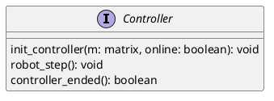
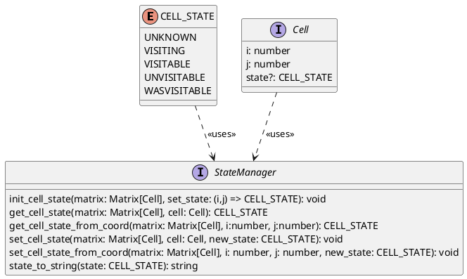

# Interfaces

## Controller

```plantuml
@startuml
interface Controller {
  init_controller(m: matrix, online: boolean): void
  robot_step(): void
  controller_ended(): boolean
}
@enduml
```

## Cell State

```plantuml
@startuml
Enum CELL_STATE {
  UNKNOWN
  VISITING
  VISITABLE
  UNVISITABLE
  WASVISITABLE
}

Interface Cell {
  i: number
  j: number
  state?: CELL_STATE
}

interface StateManager {
  init_cell_state(matrix: Matrix[Cell], set_state: (i,j) => CELL_STATE): void
  get_cell_state(matrix: Matrix[Cell], cell: Cell): CELL_STATE
  get_cell_state_from_coord(matrix: Matrix[Cell], i:number, j:number): CELL_STATE
  set_cell_state(matrix: Matrix[Cell], cell: Cell, new_state: CELL_STATE): void
  set_cell_state_from_coord(matrix: Matrix[Cell], i: number, j: number, new_state: CELL_STATE): void
  state_to_string(state: CELL_STATE): string
}

CELL_STATE ..> StateManager : <<uses>>
Cell ..> StateManager : <<uses>>
@enduml
```