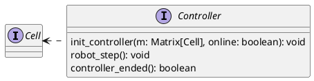
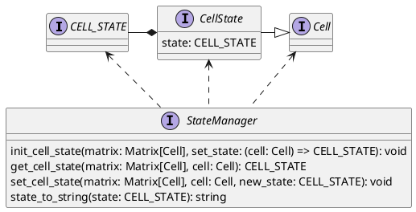
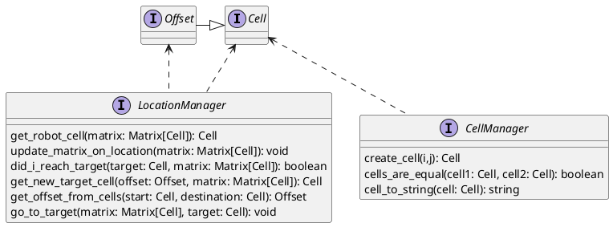

# Introduction
This autogenerated website stores all the relevant artifact produced to document the CPP-analysis project

## Interfaces

### Controller

```plantuml
@startuml

Interface Cell {
}

interface Controller {
  init_controller(m: Matrix[Cell], online: boolean): void
  robot_step(): void
  controller_ended(): boolean
}
Cell <. Controller
@enduml
```

### Cell State

```plantuml
@startuml
/'Enum CELL_STATE {
  UNKNOWN
  VISITING
  VISITABLE
  UNVISITABLE
  WASVISITABLE
}'/
Interface CELL_STATE

Interface Cell {
}

Interface CellState {
  state: CELL_STATE
}
Cell <|-left CellState

interface StateManager {
  init_cell_state(matrix: Matrix[Cell], set_state: (cell: Cell) => CELL_STATE): void
  get_cell_state(matrix: Matrix[Cell], cell: Cell): CELL_STATE
  set_cell_state(matrix: Matrix[Cell], cell: Cell, new_state: CELL_STATE): void
  state_to_string(state: CELL_STATE): string
}

CELL_STATE -* CellState
CELL_STATE <.. StateManager
CellState <.. StateManager
Cell <.. StateManager
@enduml
```

### Location

```plantuml
@startuml

Interface Cell {
}

Interface Offset {
}
Cell <|-left Offset

Interface CellManager {
  create_cell(i,j): Cell
  cells_are_equal(cell1: Cell, cell2: Cell): boolean
  cell_to_string(cell: Cell): string
}

interface LocationManager {
  get_robot_cell(matrix: Matrix[Cell]): Cell
  update_matrix_on_location(matrix: Matrix[Cell]): void
  did_i_reach_target(target: Cell, matrix: Matrix[Cell]): boolean
  get_new_target_cell(offset: Offset, matrix: Matrix[Cell]): Cell
  get_offset_from_cells(start: Cell, destination: Cell): Offset
  go_to_target(matrix: Matrix[Cell], target: Cell): void
}

Cell <.. CellManager
Cell <.. LocationManager
Offset <.. LocationManager
@enduml
```